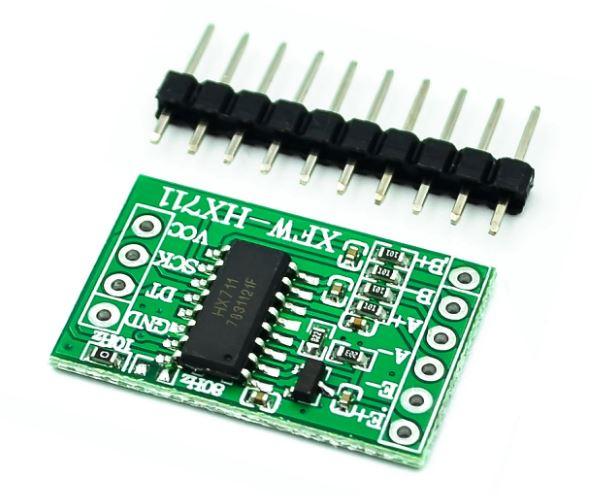
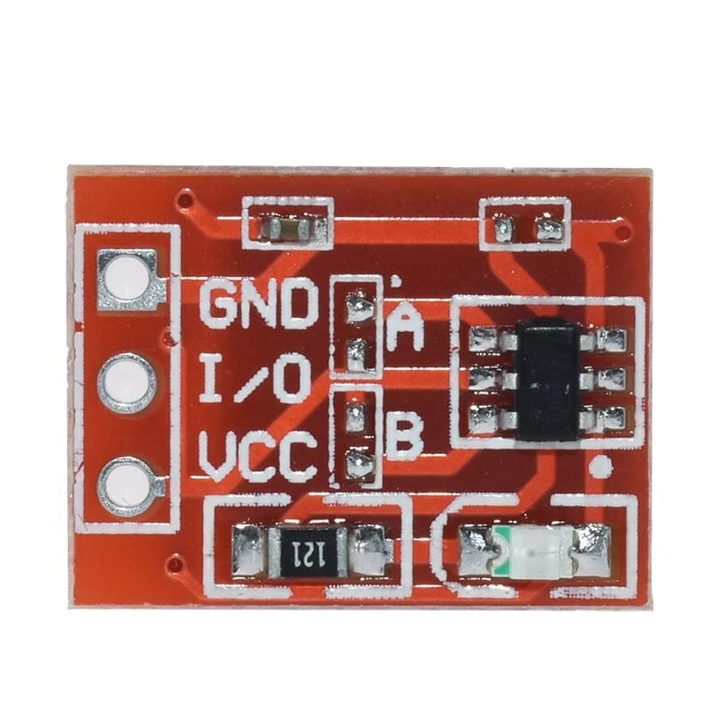
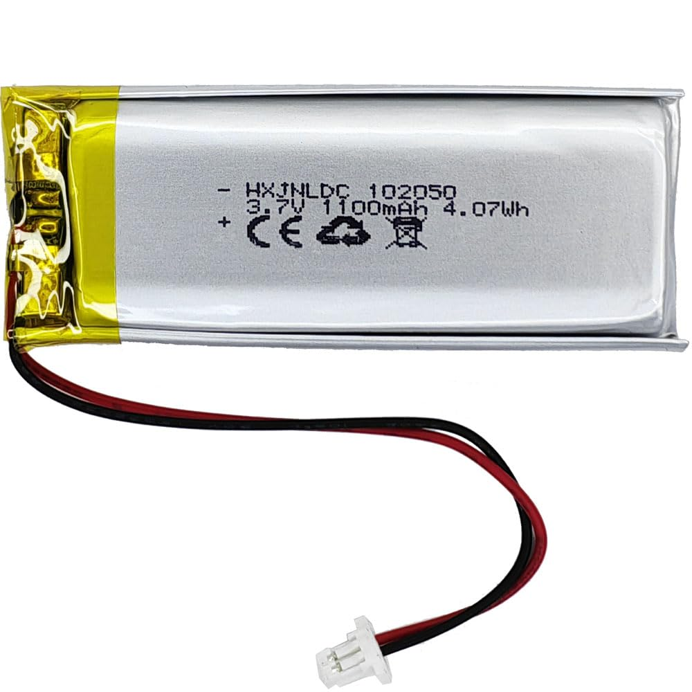
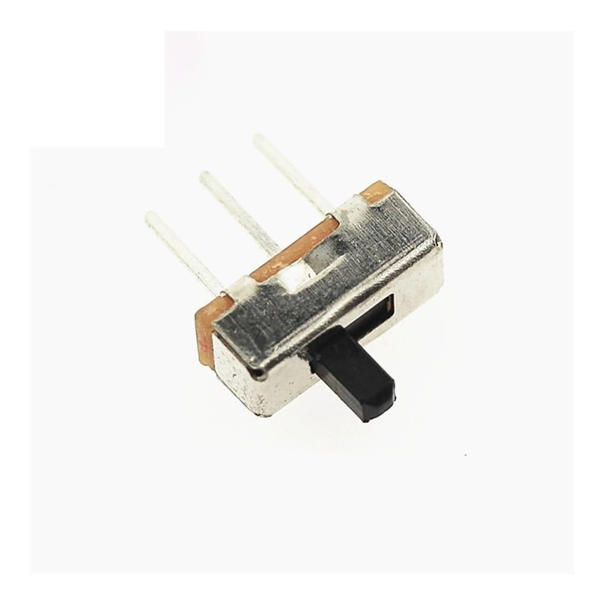

# BrewMate

BrewMate is my personal take on a compact coffee scale, derived from [WeighMyBru](https://github.com/031devstudios/weighmybru2). This isn't meant to be a replacement for WeighMyBru—it's just something I designed for myself to suit my preferences, and I'm sharing it in case anyone else wants it too.

Even though the 3D models and code for BrewMate were written from scratch, the project is fundamentally derived from WeighMyBru. I wanted to make the scale more compact and redesign both the scale and web user interfaces to fit my preferences.

BrewMate features a compact form factor of 80×80×18mm. I'm redesigning the scale UI to have a more informative main screen with battery status, Bluetooth, and WiFi status indicators. The project also includes extra hardware modifications to support battery charging detection (VBUS voltage detection using a voltage divider) and battery disconnect detection (3rd switch pin).

## Software Status

⚠️ **Important**: The BrewMate software is currently a work in progress (WIP) and is not ready for use. However, the compact case and alternative hardware can be used with the [WeighMyBru software](https://github.com/031devstudios/weighmybru2).

## Hardware

- ESP32-based microcontroller
  - XIAO ESP32C6
- HX711 load cell amplifier
- SSD1306 OLED display (128x32)
- TTP223 touch sensors
- 500g load cell
- 3.7V 1000mAh battery

## Hardware Differences from WeighMyBru

To fit my more compact case design, some component modifications are needed compared to the standard WeighMyBru BOM. The following table details the components that fit in this compact case:

| Component                     | Differences                                                                                                                                 | Image                                |
| ----------------------------- | ------------------------------------------------------------------------------------------------------------------------------------------- | ------------------------------------ |
| **HX711 Load Cell Amplifier** | Uses the compact version without screw holes (instead of the large version with screw holes). Required to fit within the smaller enclosure. |    |
| **TTP223 Touch Sensors**      | Uses compact version with red PCB (instead of standard size). Necessary for the reduced space.                                              |  |
| **Battery**                   | Uses 102050 battery (10mm × 20mm × 50mm) instead of various sizes. Battery sizing is less forgiving due to the small enclosure.             |  |
| **Switch**                    | Uses 4mm stem switch (optional, instead of 5mm stem). A 5mm switch will work but will stick out further and can be cut to length if needed. |         |

## Features

- Flow rate calculation
- Battery level monitoring with USB charging detection
- Compact form factor
- WiFi Access Point mode for initial setup
- WiFi client mode to connect to your home network
- Web-based user interface
- Real-time weight and battery status via web API

## WiFi Web Interface

The scale includes a WiFi Access Point mode for initial setup. When powered on, the scale creates a WiFi network named "BrewMate" (password: `brewmate123`) that allows you to configure the device and connect it to your home WiFi network.

### Setup

1. **Build the web UI:**

   ```bash
   cd web
   pnpm install
   pnpm build
   ```

2. **Upload web files to LittleFS:**

   ```bash
   pio run -t uploadfs
   ```

3. **Upload the firmware:**

   ```bash
   pio run -t upload
   ```

4. **Initial Setup:**

   - Connect your device to the "BrewMate" WiFi network
   - Open a browser and navigate to `http://192.168.4.1`
   - Configure the scale to connect to your home WiFi network
   - Once connected, the scale will switch to WiFi client mode and can be accessed via your local network

5. **Using the scale:**
   - After initial setup, access the web interface via your local network
   - The web interface displays real-time weight, battery status, and allows you to tare the scale

### API Endpoints

- `GET /api/status` - Returns current scale status (weight, battery percentage, voltage, USB connection status)
- `POST /api/tare` - Tares the scale

The display will show a WiFi AP icon when the access point is active (during initial setup). Once connected to your WiFi network, the device operates in client mode.

## Credits

This project is derived from the [WeighMyBru](https://github.com/031devstudios/weighmybru2) project. While the 3D models and code for BrewMate were written from scratch, the project builds upon the WeighMyBru foundation. Thanks to the WeighMyBru project for the inspiration and foundation!

## License

This project is licensed under [CC BY-NC-SA 4.0](https://creativecommons.org/licenses/by-nc-sa/4.0/) (Creative Commons Attribution-NonCommercial-ShareAlike 4.0 International).

This means:

- **Attribution**: You must give appropriate credit
- **NonCommercial**: You may not use this work for commercial purposes
- **ShareAlike**: If you remix, transform, or build upon the material, you must distribute your contributions under the same license
